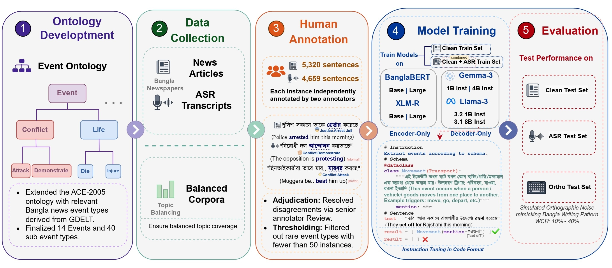

# Bangla Event Detection Robustness

Code for *Beyond Clean Text: Evaluating Encoder and Decoder Robustness for Bangla Event Detection in Noisy Text*.



## Setup

```bash
pip install -r requirements.txt
```

## Data

All splits are pre-generated in `Dataset/splits/`:

| Dataset | Train | Val | Test |
|---|---|---|---|
| Clean | `splits/clean/train.jsonl` (3706) | `splits/clean/val.jsonl` (798) | `splits/clean/test.jsonl` (816) |
| ASR | `splits/asr/train.jsonl` (3242) | `splits/asr/val.jsonl` (463) | `splits/asr/test.jsonl` (954) |
| Combined | `splits/combined/train.jsonl` (6948) | `splits/combined/val.jsonl` (1261) | -- |
| Noise | -- | -- | `splits/noise/test_wcr{10,20,30,40}.jsonl` (816 each) |

SFT files for decoder training: `splits/sft/train_{guided,basic,combined}.jsonl`.

Source annotations: `news_annotations.jsonl`, `asr_annotations.jsonl`.

### Regenerate splits from source

```bash
python -m scripts.prepare_data --input Dataset/news_annotations.jsonl --output_dir Dataset/splits --mode news
python -m scripts.prepare_data --input Dataset/asr_annotations.jsonl --output_dir Dataset/splits --mode asr --val_ratio 0.10 --test_ratio 0.20
```

### Generate noise test sets

```bash
python -m scripts.generate_noise --input Dataset/splits/clean/test.jsonl --output_dir Dataset/splits/noise
```

### Combine splits

```bash
python -m scripts.combine_splits --clean_dir Dataset/splits/clean --asr_dir Dataset/splits/asr --output_dir Dataset/splits/combined --split train
python -m scripts.combine_splits --clean_dir Dataset/splits/clean --asr_dir Dataset/splits/asr --output_dir Dataset/splits/combined --split val
```

## Encoder Models

```bash
# Train on clean
python -m scripts.train_encoder \
  --model_name csebuetnlp/banglabert \
  --train_file Dataset/splits/clean/train.jsonl \
  --val_file Dataset/splits/clean/val.jsonl \
  --output_dir models/encoders/banglabert_clean

# Train on combined
python -m scripts.train_encoder \
  --model_name xlm-roberta-large \
  --train_file Dataset/splits/combined/train.jsonl \
  --val_file Dataset/splits/combined/val.jsonl \
  --output_dir models/encoders/xlmr_large_combined

# Evaluate
python -m scripts.eval_encoder \
  --model_dir models/encoders/banglabert_clean/final \
  --test_file Dataset/splits/asr/test.jsonl

python -m scripts.eval_encoder \
  --model_dir models/encoders/banglabert_clean/final \
  --test_file Dataset/splits/noise/test_wcr40.jsonl
```

## Decoder Models

```bash
# Using pre-formatted SFT files
python -m scripts.train_decoder \
  --model_name unsloth/Llama-3.1-8B-Instruct \
  --train_file Dataset/splits/sft/train_guided.jsonl \
  --val_file Dataset/splits/sft/val_guided.jsonl \
  --output_dir models/decoders/llama8b_clean

# Guideline-free variant
python -m scripts.train_decoder \
  --model_name unsloth/Llama-3.2-1B-Instruct \
  --train_file Dataset/splits/sft/train_basic.jsonl \
  --output_dir models/decoders/llama1b_noguide

# Combined training
python -m scripts.train_decoder \
  --model_name unsloth/Llama-3.2-1B-Instruct \
  --train_file Dataset/splits/sft/train_combined.jsonl \
  --output_dir models/decoders/llama1b_combined

# Evaluate
python -m scripts.eval_decoder \
  --model_name unsloth/Llama-3.1-8B-Instruct \
  --lora_path models/decoders/llama8b_clean \
  --test_file Dataset/splits/clean/test.jsonl
```

## Models

| Arch | Model | Sizes |
|---|---|---|
| Encoder | BanglaBERT | 110M, 335M |
| Encoder | XLM-RoBERTa | 270M, 550M |
| Decoder | Llama 3 | 1B, 8B |
| Decoder | Gemma 3 | 1B, 4B |

## Training

**Encoders**: AdamW, lr=2e-5, wd=0.01, warmup 10%, max_seq=128, 15 epochs, patience 3.

**Decoders**: LoRA r=16, alpha=32, dropout=0, lr=1e-4, cosine schedule, batch=64, 5 epochs, patience 3.

## Analysis

Results are stored in `plots/data/` as CSV files. Three plotting scripts generate publication-ready figures:

```bash
# Decomposed macro F1 bar chart (clean vs retained vs drop)
python plots/gen_macro_f1_decomposed.py

# Macro F1 vs. WCR line plots (separate for LLMs and encoders)
python plots/plot_wcr_vs_macro_f1.py

# McNemar significance heatmap (encoder vs. decoder per corruption type)
python plots/plot_significance_heatmap.py
```

Output figures are saved to `plots/figures/` (gitignored).

### Statistical significance test

```bash
# Requires model prediction files under models/ (see below for structure)
python -m scripts.mcnemar_test
```

Expects predictions in `models/encoders/<model>/<wcr>/predictions_synthetic_test_wcr_<N>.json` and `models/decoders/<model>/<wcr>/predictions_final.jsonl`.

